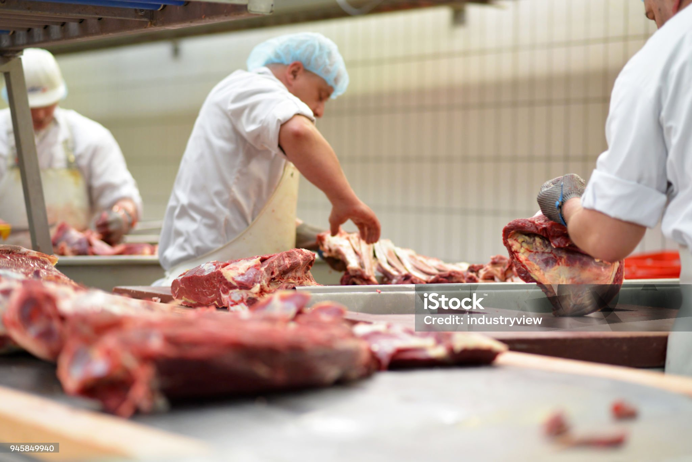

# Operational KPIs for Meat Trimming Efficiency
Data-Driven Insights from a Meat Processing Facility in the Southern U.S.

## Project summary

This project analyzes operational data from a meat processing plant located in the Southern region of the United States. 
The focus is on evaluating employee performance and labor cost efficiency in the meat trimming process — a core task where precision, speed, and cost control are essential.

By calculating and visualizing key performance indicators (KPIs), this analysis provides actionable insights for plant managers, operations analysts, and decision-makers looking to optimize labor productivity, reduce waste, and track output trends over time.

## Business context

Meat trimming is a labor-intensive step in the meat processing workflow. Employees manually remove fat, connective tissue, and bone from primal cuts to produce market-ready products such as steaks, roasts, or ground meat.

Given the high cost of labor and the variability of yield by employee, processing plants often monitor:

- Productivity (pounds/hour)
- Cost efficiency (labor cost per pound)
- Monthly output by worker
- Performance variability

These metrics are critical for cost control, workforce planning, and incentive systems in facilities that serve domestic and export markets.

## KPIs implemented

| KPI   | Description |
| ------------- | ------------- |
| Average Pounds per Hour  | Measures individual employee productivity  |
| Cost per Pound Trimmed  | Labor cost efficiency metric  |
| Monthly Output per Employee | Total volume processed per worker per month |
| Monthly Cost Efficiency | Total pounds trimmed per dollar spent on labor |
| Performance Variability | Tracks inconsistency in trimming speed across employees |
| Top Performer Identification | Ranks employees by trimming efficiency |
	

## Tableau dashboard

An interactive Tableau Public dashboard has been created to explore the KPIs visually and intuitively.

🔗 View the Live Dashboard on Tableau Public
(https://public.tableau.com/app/profile/valeria.burgos/viz/Meatprocessingplant-KPIs/Dashboard1)

The dashboard includes:

- Monthly trends in productivity and cost
- Employee rankings
- Variability heatmaps
- Year-over-year comparisons

## Tech stack

Python 3.11+
- pandas, numpy – data processing
- Jupyter – data exploration

Tableau Public 
- Used to create dynamic and shareable KPI dashboards)

## Ideal use cases

- Plant managers optimizing labor costs and staffing
- HR designing performance-based incentive programs
- Operational analysts and consultants in food processing
- Companies looking to integrate data-driven insights into meat production

## Disclaimer
This project is adapted from a professional assignment. To maintain client confidentiality, the original data and results are not shared here.  
All datasets have been replaced with simulated or publicly available sources, and the code is provided solely to demonstrate the methodology and technical approach.
